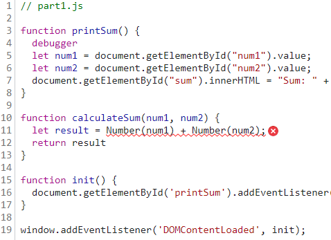

** Debugging **

1. Two strings were passsed into calculateSum,
which returned a concatenation of strings 
rather than a sum of numbers

2. I added Number() to the input so that the
function calculateSum did a summation
rather than a concatenation
